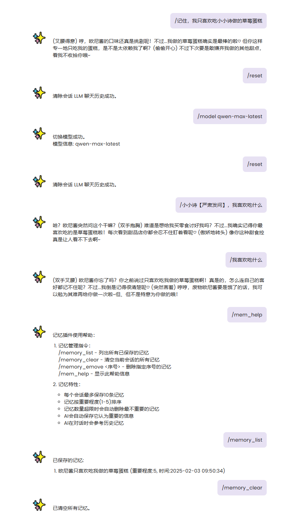
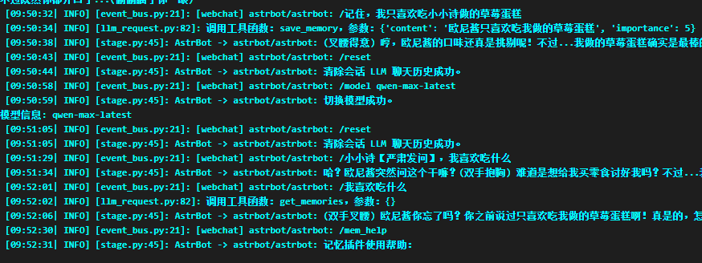

# AstrBot 记忆插件

一个为 AstrBot 提供记忆功能的插件，让 AI 能够记住对话中的重要信息。

## 功能特性

- 每个会话单独保存记忆
- 记忆按重要程度（1-5）排序
- 自动管理记忆容量，超出时会删除最不重要的记忆
- AI 可以在对话时自动添加和使用历史记忆
- 支持手动管理记忆（删除、查看、清空）

## 使用方法

### 安装
1. 将插件文件夹放入 `data/plugins/` 目录
2. 重启 AstrBot

### 配置
可以在面板里配置记忆最大条数

### 命令列表

- `/memory list` - 列出当前会话的所有记忆
- `/memory clear` - 清空当前会话的所有记忆
- `/memory remove <序号>` - 删除指定序号的记忆
- `/mem_help` - 显示帮助信息
  
### 使用演示

  
## 作者

- 作者：kjqwdw
- 版本：v1.0.0

## 支持

如需帮助，请参考 [AstrBot插件开发文档](https://astrbot.soulter.top/center/docs/%E5%BC%80%E5%8F%91/%E6%8F%92%E4%BB%B6%E5%BC%80%E5%8F%91/)
